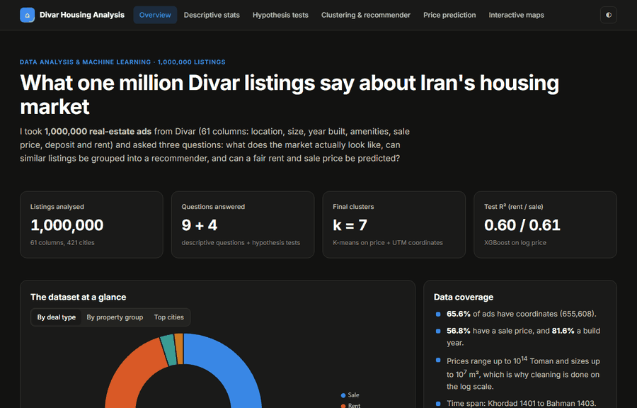
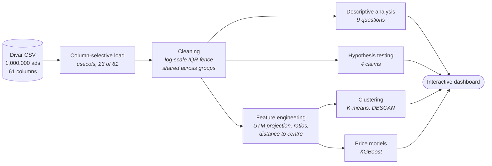
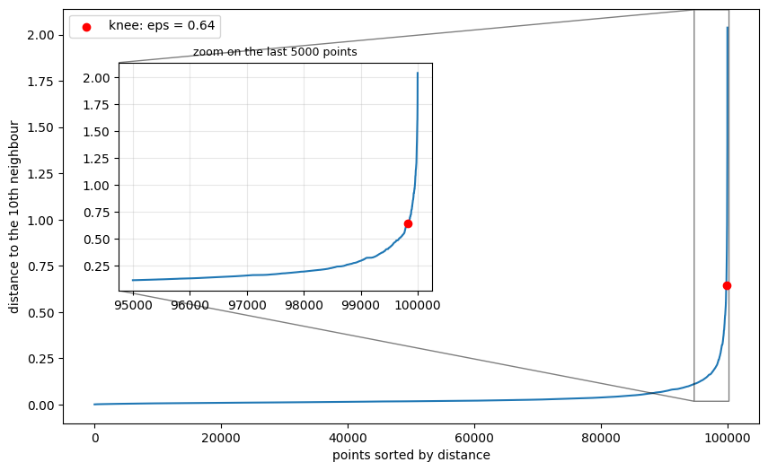
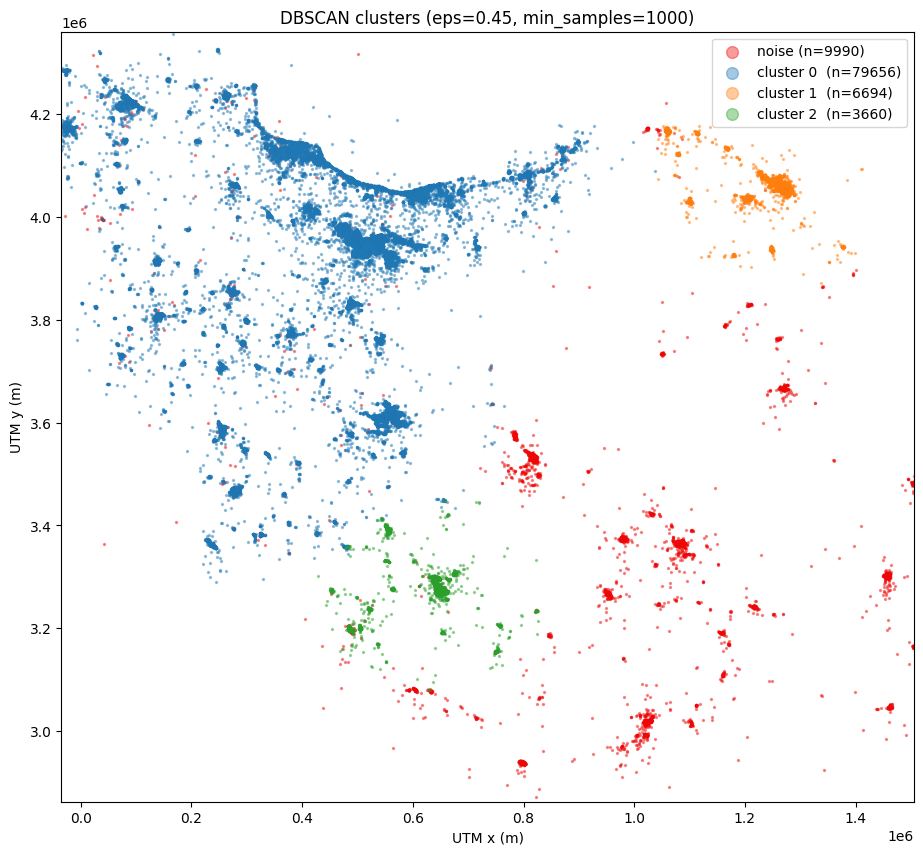
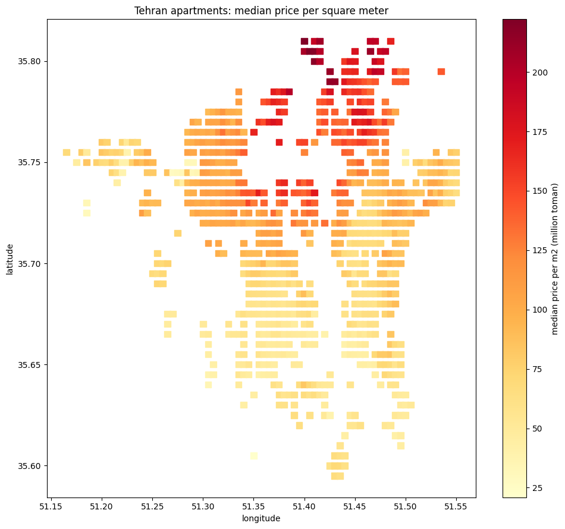
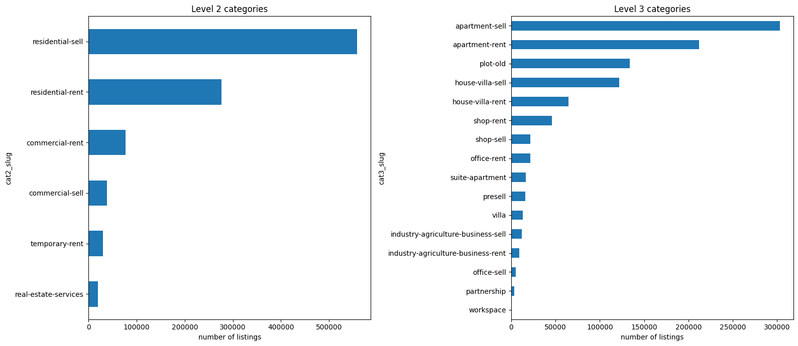
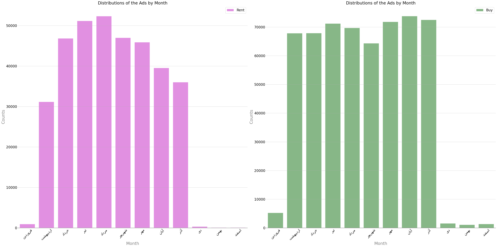

<div align="center">

# 🏘️ Iran Housing Market Analysis

### What one million listings reveal about where Iranians live, and what it costs

[](https://www.python.org)
[](https://pandas.pydata.org)
[](https://scikit-learn.org)
[](https://xgboost.readthedocs.io)
[](https://geopandas.org)


[](LICENSE)

<br>

### [**▶  Open the live dashboard**](https://mahdi-tarrah.github.io/divar-iran-housing-analysis/dashboard/)

[](https://mahdi-tarrah.github.io/divar-iran-housing-analysis/dashboard/)

<br>

[](https://mahdi-tarrah.github.io/divar-iran-housing-analysis/dashboard/)

<sub><i>Six interactive pages — click the image to explore them live.</i></sub>

</div>

---

## 🔎 Three findings worth the read

> ### 📉 A result that is statistically certain and practically meaningless
> Megacity homes come out smaller than small-city homes at *p* = 2.7×10⁻¹¹. The effect size is
> Cohen's *d* = **0.016** — a gap of **0.8 m²**. Hold property type constant and the direction
> **reverses**: megacity apartments are 6.6 m² *larger*. Small cities simply list more villas
> (34.7% against 14.1%), and villas are bigger. A textbook **Simpson's paradox**, caught only
> because every test reports effect size next to the p-value.

> ### 🏊 The amenities that signal price are not the luxury ones
> A parking space (**1.99×**) and an elevator (**1.94×**) carry nearly twice the premium of a
> swimming pool (**1.30×**), and a barbecue is worth essentially nothing (**1.05×**). Elevators and
> parking act as proxies for the quality of the whole building; pools are recorded almost only on
> villas, which are expensive to begin with.

> ### 🗺️ The market has exactly three poles
> DBSCAN on price and projected coordinates, given no cluster count, separates the country into
> **Tehran–Karaj–Isfahan**, **Mashhad** and **Shiraz** — everything else is noise.

---

## 🧭 The pipeline



---

## 📊 What's inside

| Notebook | Contents |
|---|---|
| [**01 · Descriptive statistics**](notebooks/01_descriptive_statistics.ipynb) | Category mix, build-year distribution, seasonality, price distributions, a geographic heatmap, the Jalali rent trend, inflation-adjusted real prices, a correlation matrix, and the geography of amenities |
| [**02 · Hypothesis testing**](notebooks/02_hypothesis_testing.ipynb) | Four claims tested with Welch's *t*, Mann-Whitney U, Levene, Cohen's *d* and Bonferroni correction — each re-run inside every property type |
| [**03 · Machine learning**](notebooks/03_machine_learning.ipynb) | K-means and DBSCAN clustering into a listing recommender, plus XGBoost models for rent and for sale price |
| [**🖥️ Dashboard**](https://mahdi-tarrah.github.io/divar-iran-housing-analysis/dashboard/) | A static, interactive write-up of all of the above — hosted live |

---

## 🔬 The hypothesis tests

With hundreds of thousands of rows almost any difference reaches significance, so **every test
reports how large the effect is**, and is repeated **within each property type** so a difference in
the mix of apartments and villas is never mistaken for an effect.

| # | Claim | H₀ | Verdict | Why |
|:-:|---|:-:|:-:|---|
| **1** | Megacity homes are smaller | **rejected** | ❌ **not supported** | Gap is 0.8 m², *d* = 0.016. Reverses within each property type |
| **2** | Older homes were roomier | **not rejected** | ❌ **not supported** | New homes are **17 m² larger** (117.4 vs 100 m², *d* = 0.35) |
| **3** | A business deed raises price | **rejected** | ✅ **supported, with a caveat** | **27% more expensive** (*p* = 2.7×10⁻⁴⁷) — but **not per m²** |
| **4** | Luxury amenities raise price | **rejected** | ✅ **supported — and so do non-luxury** | All eight significant under Bonferroni; non-luxury effects are **larger** |

<details>
<summary><b>📋 Price premium by amenity</b> — ratio of geometric means, residential sales</summary>

<br>

| Amenity | Category | Premium | Cohen's *d* |
|---|---|:-:|:-:|
| 🅿️ Parking | non-luxury | **1.99×** | 0.90 |
| 🛗 Elevator | non-luxury | **1.94×** | 0.89 |
| 📦 Storage | non-luxury | 1.61× | 0.59 |
| 🪟 Balcony | non-luxury | 1.58× | 0.55 |
| 🛁 Jacuzzi | luxury | 1.42× | 0.40 |
| 🏊 Pool | luxury | 1.30× | 0.31 |
| 🧖 Sauna | luxury | 1.22× | 0.22 |
| 🍖 Barbecue | luxury | 1.05× | 0.06 |

</details>

---

## 🤖 Machine learning

### Clustering and the recommender

Four candidate feature sets were scored on silhouette, Calinski-Harabasz and Davies-Bouldin.
**Price + projected coordinates won every metric** — each extra feature made the clusters measurably
worse while adding dimensions.

| Feature set | Silhouette ↑ | Calinski ↑ | Davies ↓ |
|---|:-:|:-:|:-:|
| price + UTM + size | 0.381 | 102,768 | 1.029 |
| … + rooms | 0.344 | 74,909 | 1.088 |
| **price + UTM** | **0.476** | **186,268** | **0.751** |
| … + build year | 0.329 | 94,460 | 0.992 |

Coordinates are projected to **UTM zone 39** so distances stay comparable nationwide; clustering on
raw latitude/longitude silently distorts them.

<div align="center">


</div>

The elbow curve has **no visible knee** — a common outcome the usual visual rule cannot resolve.
`k = 7` was settled by combining `KneeLocator`, the three quality metrics, and a side-by-side
comparison of cluster profiles at `k = 4` and `k = 7`.

<div align="center">


</div>

### Price prediction

| Model | Target | Test R² | MAE | Notes |
|---|---|:-:|---|---|
| XGBoost | monthly rent | **0.600** | 0.685 *(log)* | Validation R² 0.609 — a 0.009 gap, so no overfitting to validation |
| XGBoost | sale price | **0.605** | ≈ 1.36 B Toman | Group-wise imputation + target encoding |

Both follow the same discipline: the data is split **before any preprocessing**, every imputation
statistic and encoding is fit **on the training fold only**, and the test set is touched exactly
once, for the final model.

Dropping `credit_value` collapses the rent model from R² 0.609 to **0.260** — most of the signal in
a rental listing is the deposit.

---

## 🖼️ Selected figures

<div align="center">

| | |
|:-:|:-:|
| <br><sub>Amenity share by city</sub> | <br><sub>Tehran price per m² on a 500 m grid</sub> |
| <br><sub>Listing mix by category</sub> | <br><sub>Seasonality of supply</sub> |

</div>

---

## 🚀 Running it

```bash
git clone https://github.com/Mahdi-Tarrah/divar-iran-housing-analysis.git
cd divar-iran-housing-analysis

python -m venv .venv
.venv\Scripts\activate          # Windows
source .venv/bin/activate       # macOS / Linux

pip install -r requirements.txt
```

Download `Divar.csv` into `data/` — see [`data/README.md`](data/README.md) — then:

```bash
jupyter lab notebooks/
```

Each notebook is self-contained and loads only the columns it needs, so any one can be run on its
own. Expect **3–4 GB of RAM** at peak and about **20 minutes** for the machine-learning notebook.

The dashboard is already hosted at **[mahdi-tarrah.github.io/divar-iran-housing-analysis/dashboard/](https://mahdi-tarrah.github.io/divar-iran-housing-analysis/dashboard/)**. To run your own copy:

```bash
python -m http.server 8000
# open http://localhost:8000/dashboard/
```

---

## 📁 Repository layout

```
divar-iran-housing-analysis/
├── notebooks/
│   ├── 01_descriptive_statistics.ipynb    market structure, geography, real prices
│   ├── 02_hypothesis_testing.ipynb        four claims, with effect sizes
│   └── 03_machine_learning.ipynb          clustering, recommender, two price models
├── dashboard/
│   ├── index.html                         start here
│   ├── statistics.html  hypothesis.html
│   ├── clustering.html  prediction.html  maps.html
│   └── assets/                            css, vendored Chart.js, exported figures
├── data/
│   ├── iran_city_classification.csv       megacity / small-city lookup
│   └── README.md                          how to obtain Divar.csv
├── outputs/maps/                          interactive Folium maps
├── requirements.txt
└── LICENSE
```

---

## 🛠️ Methods worth noting

**Cleaning on the log scale.** Sizes and prices span seven orders of magnitude and are heavily
right-skewed. An IQR fence applied directly removes thousands of large but genuine properties, so the
fence is computed on `log(size)` — and as **one shared boundary across both groups**, so a test never
compares two differently-filtered populations.

**Effect size next to every p-value.** At *n* ≈ 10⁵ a p-value mostly measures sample size. Cohen's
*d* and geometric-mean ratios answer what p-values cannot: *is the difference big enough to matter?*

**Testing within subgroups.** Every hypothesis test is repeated inside each property type. In three
of the four this changed the interpretation; in the first it reversed the direction outright.

**Why Welch's t-test survives non-normal data.** Shapiro-Wilk rejects normality on every column here,
as it will for any large sample. The t-test's actual requirement is that the *sampling distribution
of the mean* be normal, which the central limit theorem guarantees at this scale. Levene's test
drives the choice of Welch over Student (*p* = 0.0099 in test 1), and Mann-Whitney U is reported
alongside as a distribution-free check — it agrees in all four tests.

**No leakage.** Splits happen before preprocessing, group statistics come from the training fold
only, and the test set is scored once.

---

## 📄 License

[MIT](LICENSE) · Analysis and code by **Mahdi Tarrah**

The Divar dataset belongs to its original publisher and is not redistributed here.
