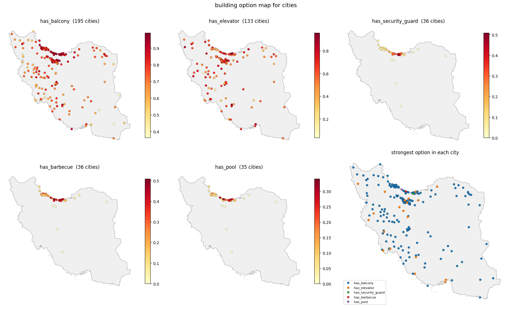
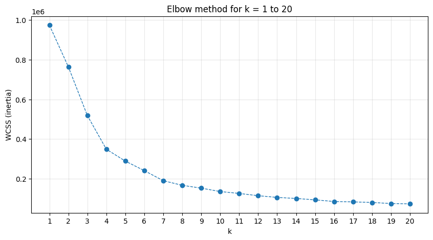
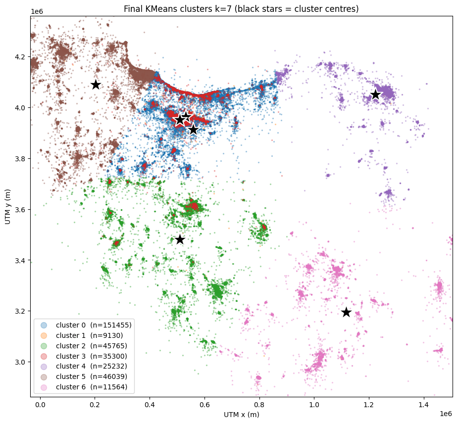

<div align="center">

# 🏘️ Iran Housing Market Analysis

### What one million listings reveal about where Iranians live, and what it costs

[](https://www.python.org)
[](https://pandas.pydata.org)
[](https://scikit-learn.org)
[](https://xgboost.readthedocs.io)
[](https://geopandas.org)
[](LICENSE)

**1,000,000 listings · 61 columns · 421 cities · 9 descriptive questions · 4 hypothesis tests · 3 models**



</div>

---

## The short version

A full analysis pipeline over the public **Divar** real-estate dataset — one million Iranian property
listings — from raw CSV to an interactive dashboard. Three things make it more than a plotting exercise:

> **📉 A statistically significant result that means nothing.**
> Megacity homes come out smaller than small-city homes with *p* = 2.7×10⁻¹¹. The effect size is
> Cohen's *d* = 0.016 — a difference of **0.8 m²**. Hold property type constant and the direction
> **reverses**: megacity apartments are 6.6 m² *larger*. A textbook Simpson's paradox, caught because
> every test reports effect size next to the p-value.

> **🏊 The amenities that signal price aren't the luxury ones.**
> A parking space (1.99×) and an elevator (1.94×) carry nearly twice the price premium of a swimming
> pool (1.30×) — and a barbecue is worth essentially nothing (1.05×). Elevators and parking are
> proxies for the quality of the entire building; pools are recorded almost exclusively on villas,
> which are expensive to begin with.

> **🗺️ Iran's housing market has exactly three poles.**
> DBSCAN on price and projected coordinates, with no cluster count supplied, separates the country
> into Tehran–Karaj–Isfahan, Mashhad, and Shiraz — with everything else as noise.

---

## 📊 What's inside

| Notebook | Contents |
|---|---|
| [**01 · Descriptive statistics**](notebooks/01_descriptive_statistics.ipynb) | Nine questions on the shape of the market: category mix, build-year distribution, seasonality, price distributions, a geographic heatmap, the Jalali rent trend, inflation-adjusted real prices, a correlation matrix, and the geography of amenities |
| [**02 · Hypothesis testing**](notebooks/02_hypothesis_testing.ipynb) | Four claims about the market tested with Welch's *t*, Mann-Whitney U, Cohen's *d* and Bonferroni correction — each one re-run inside every property type |
| [**03 · Machine learning**](notebooks/03_machine_learning.ipynb) | K-means and DBSCAN clustering into a listing recommender, plus XGBoost models for rent and for sale price |
| [**🖥️ Dashboard**](dashboard/index.html) | A static, interactive write-up of all of the above — no build step, opens straight from disk |

---

## 🔬 The hypothesis tests

Four widely held beliefs, tested on the data. With hundreds of thousands of rows almost any difference
reaches significance, so **every test reports how large the effect is**, and is repeated **within each
property type** so a difference in the mix of apartments and villas is never mistaken for an effect.

| # | Claim | H₀ | Verdict | Why |
|:-:|---|:-:|:-:|---|
| **1** | Megacity homes are smaller | **rejected** | ❌ **not supported** | Gap is 0.8 m², *d* = 0.016. Reverses within each property type — small cities simply list more villas (34.7% vs 14.1%) |
| **2** | Older homes were roomier | **not rejected** | ❌ **not supported** | New homes are **17 m² larger** (117.4 vs 100 m², *d* = 0.35). The one-sided *p* hits 1.0 because the data runs opposite to the claim |
| **3** | A business deed raises price | **rejected** | ✅ **supported, with a caveat** | Deeded property is **27% more expensive** (*p* = 2.7×10⁻⁴⁷) — but **not per m²**. Most of the gap is that deeded properties are larger |
| **4** | Luxury amenities raise price | **rejected** | ✅ **supported — and so do non-luxury** | All eight amenities significant under Bonferroni. The surprise: non-luxury effects are **larger** |

<details>
<summary><b>Price premium by amenity</b> (ratio of geometric means, residential sales)</summary>

| Amenity | Category | Premium | Cohen's *d* |
|---|---|:-:|:-:|
| Parking | non-luxury | **1.99×** | 0.90 |
| Elevator | non-luxury | **1.94×** | 0.89 |
| Storage | non-luxury | 1.61× | 0.59 |
| Balcony | non-luxury | 1.58× | 0.55 |
| Jacuzzi | luxury | 1.42× | 0.40 |
| Pool | luxury | 1.30× | 0.31 |
| Sauna | luxury | 1.22× | 0.22 |
| Barbecue | luxury | 1.05× | 0.06 |

</details>

---

## 🤖 Machine learning

### Clustering and the recommender

Four candidate feature sets were scored on silhouette, Calinski-Harabasz and Davies-Bouldin.
**Price + projected coordinates won** — every additional feature (size, rooms, build year) made the
clusters measurably worse while adding dimensions.

Coordinates are projected to **UTM zone 39** so that distances stay comparable across the country;
clustering on raw latitude/longitude silently distorts them.

<div align="center">


</div>

The elbow curve has **no visible knee** — a common outcome that the usual visual rule cannot resolve.
`k = 7` was settled by combining `KneeLocator`, the three quality metrics, and a side-by-side
comparison of the cluster profiles at `k = 4` and `k = 7`.

DBSCAN on the same two features, with `eps` chosen from a k-distance plot, recovers **three dense
market poles** and labels the long tail as noise.

### Price prediction

| Model | Target | Test R² | MAE | Notes |
|---|---|:-:|---|---|
| XGBoost | monthly rent | **0.602** | 0.685 *(log)* | Validation R² 0.612 — a 0.01 gap, so no overfitting to the validation set |
| XGBoost | sale price | **0.606** | ≈ 1.36 B Toman | Group-wise imputation + target encoding |

Both models follow the same discipline: the data is split **before any preprocessing**, every imputation
statistic and encoding is fit **on the training fold only**, and the test set is touched exactly once,
for the final model.

---

## 🚀 Running it

```bash
git clone https://github.com/Mahdi-Tarrah/divar-iran-housing-analysis.git
cd divar-iran-housing-analysis

python -m venv .venv
.venv\Scripts\activate          # Windows
source .venv/bin/activate       # macOS / Linux

pip install -r requirements.txt
```

Download `Divar.csv` into `data/` — see [`data/README.md`](data/README.md) — then:

```bash
jupyter lab notebooks/
```

Run the notebooks in order. Each is self-contained and loads only the columns it needs, so you can run
any one of them on its own. Expect **3–4 GB of RAM** at peak.

To view the dashboard:

```bash
python -m http.server 8000
# open http://localhost:8000/dashboard/
```

---

## 📁 Repository layout

```
divar-iran-housing-analysis/
├── notebooks/
│   ├── 01_descriptive_statistics.ipynb    nine descriptive questions
│   ├── 02_hypothesis_testing.ipynb        four hypothesis tests
│   └── 03_machine_learning.ipynb          clustering, recommender, two price models
├── dashboard/
│   ├── index.html                         start here
│   ├── statistics.html  hypothesis.html
│   ├── clustering.html  prediction.html  maps.html
│   └── assets/                            css, vendored Chart.js, exported figures
├── data/
│   ├── iran_city_classification.csv       megacity / small-city lookup
│   └── README.md                          how to obtain Divar.csv
├── outputs/maps/                          interactive Folium maps (generated)
├── requirements.txt
└── LICENSE
```

---

## 🛠️ Methods worth noting

**Cleaning on the log scale.** Property sizes and prices span seven orders of magnitude and are
heavily right-skewed. Applying an IQR fence directly removes thousands of large but entirely genuine
properties, so the fence is computed on `log(size)` instead — and as **one shared boundary across both
groups**, so a test never compares two differently-filtered populations.

**Effect size next to every p-value.** At n ≈ 10⁵ a p-value mostly measures sample size. Cohen's *d*
and geometric-mean ratios answer the question p-values cannot: *is the difference big enough to care about?*

**Testing within subgroups.** Every hypothesis test is repeated inside each property type. In three of
the four tests this changed the interpretation, and in the first it reversed the direction outright.

**Why Welch's t-test survives non-normal data.** Shapiro-Wilk rejects normality on every column here —
as it will for any large sample, since it flags arbitrarily small deviations once *n* grows. The t-test's
actual requirement is that the *sampling distribution of the mean* be normal, which the central limit
theorem guarantees at this scale. Mann-Whitney U is reported alongside as a distribution-free check, and
agrees with the t-test in all four tests.

---

## 📄 License

[MIT](LICENSE) · Analysis and code by **Mahdi Tarrah**

The Divar dataset is the property of its original publisher and is not redistributed here.
